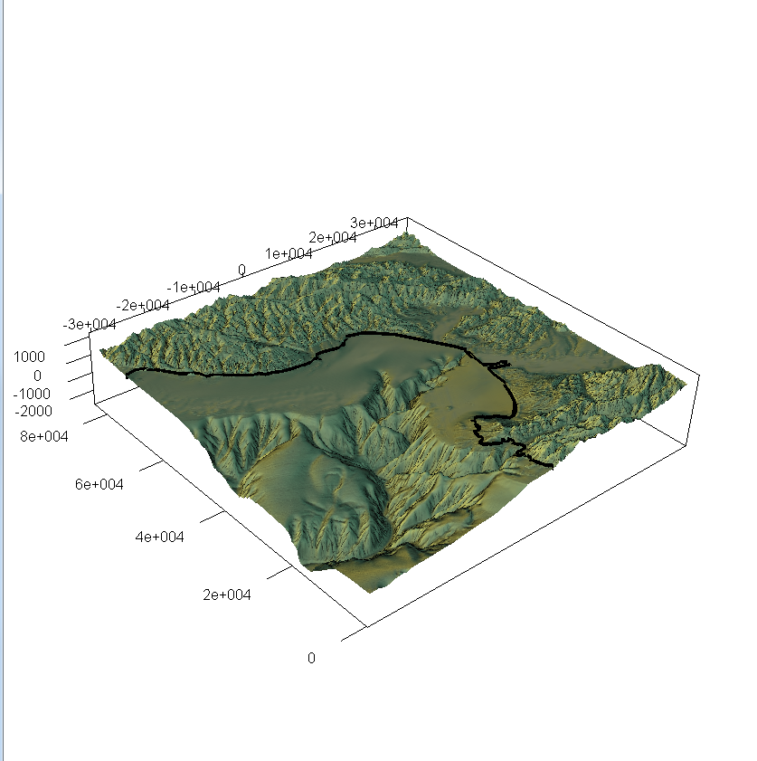
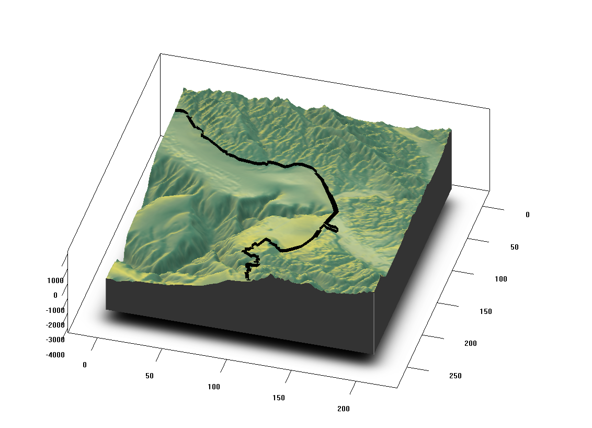

<!-- README.md is generated from README.Rmd. Please edit that file -->

# cartilage

The goal of cartilage is to blend rayshader image forms with absolute
coordinates in rgl.

This is very much a work in progress. See functions `ray` and `ambient`,
which expect a raster. Be careful not to input very large data (we’ll
add helpers), keep to something like 300\*300 or so unless you keen. The
output of functions is the data use to build the scene, but we don’t
have helpers for those yet.

Install from github with

``` r
devtools::install_github("hypertidy/cartilage")
```

Feedback welcome\!

Please note that the ‘cartilage’ project is released with a [Contributor
Code of Conduct](CODE_OF_CONDUCT.md). By contributing to this project,
you agree to abide by its terms.

## Older discussion:

Monterey Bay in absolute coordinates X, Y, Z (metres) with Natural Earth
coastline added (*+proj=lcc +lon\_0=-122 +lat\_0=36.45 +lat\_1=36.7
+lat\_2=37.2 +datum=WGS84*).



Here’s the same scene using plot\_3d and indexing in the NE line in
matrix index space.



# notes

Working code example is in /data-raw/monterey\_bay\_dem.R and will
download the file locally into data-raw/.

Some challenges:

  - rayshader defaults to matrix index space
  - rayshader uses `rgl.surface` with its X-Z-Y convention (affects
    light3d and aspect3d usage)
  - plot\_3d modifies the properties somehow? (I run anglr code before
    this to avoid)
  - rayshader is t(raster) orientation

Matrix orientation: t(raster) is different from image() as well) though
this works with modifying the data further by caputuring the rayshader
output with brick() to write to PNG.
